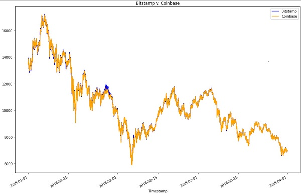
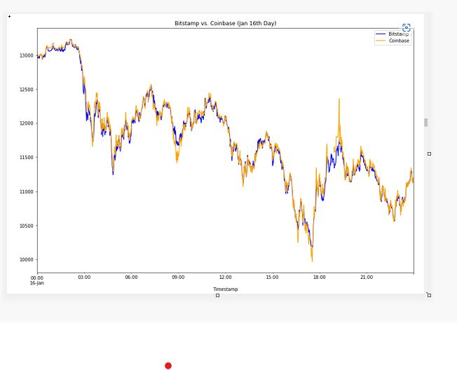
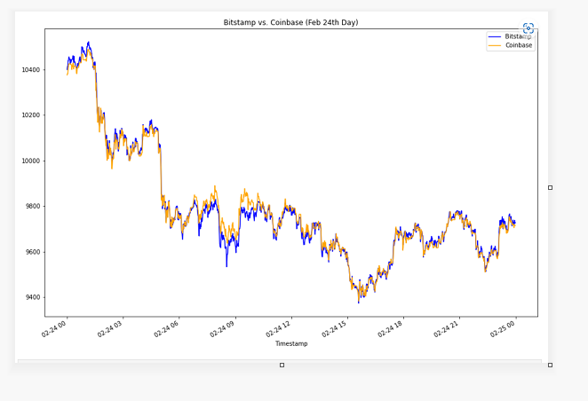
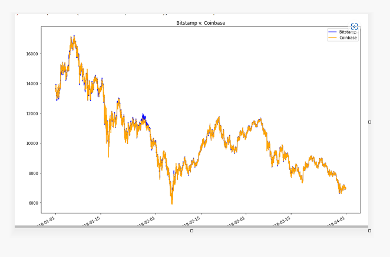
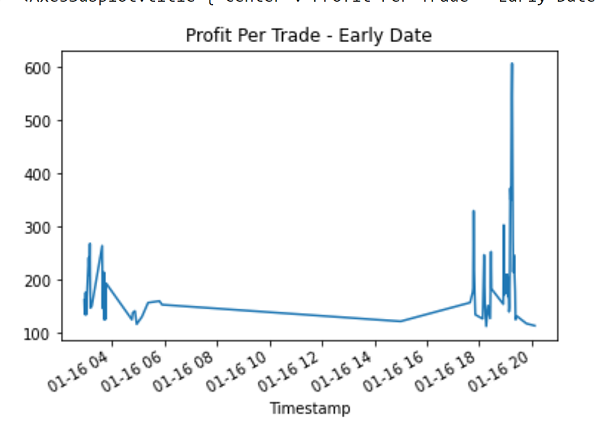
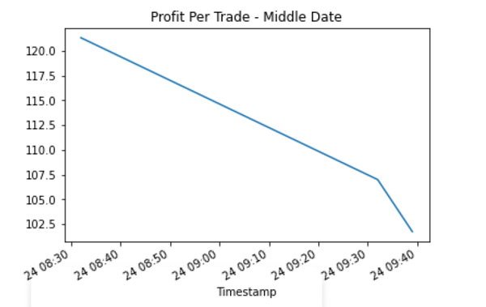
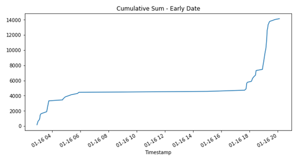
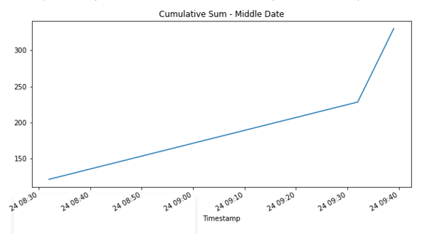

## Analysis Report:

### Task:
Perform analysis on historical trade data for Bitcoin on two exchanges: Bitstamp and Coinbase. Goal is to determine if any arbitrage opportunities exist for Bitcoin.

- After overlaying the visualizations for the bitstamp and coinbase in one plot, we determined the spread reduces as time progress. In order to find opportunites we looked at specific days from early, middle and late periods in the time series 

- Focusing analysis on specific dates for more clarity.

**Early**
1419 data points exist, an average difference between the two prices is 23.21, maximum difference between two prices is 606.80 and minimum value is -275.92, tells us that a time existed when Coinbase had a higher price than Bitstamp.

**Middle**
4137 data points exist, an average difference between the two prices is 3.39, maximum difference between two prices is 121.32 and minimum value is -50.18, still tells us that a time existed when Coinbase had a higher price than Bitstamp but at very diminishing rate.

**Late**
1432 data points exist, an average difference between the two prices is -0.72, maximum difference between two prices is 35 and minimum value is -32.04, tells us both exchanges are almost moving together.

### Initial findings
Arbitrage opportunities exist when buying in bitstamp exchange and sell in coinbase exchange

### Calculating the arbitrage profits using positive data and assuming 1% cost of conducting trade.

### Summary statistics  plots for profit per trade 

### cum sum total per trade 

- Conclsion:

The arbitrage profit opportunities for Early period(January 16, 2018) is more compared to the remaning periods.
The arbitrage sum total profit for early period is $14147.169

The arbitrage profit of $330.07 that occured during middle period (February 24, 2018) Concludes that there is very less opportunity than the early period.

There are no profitable arbitrage trades in the late period(March 28,2018).Thus the prices for both the Exchanges remain almost same.
