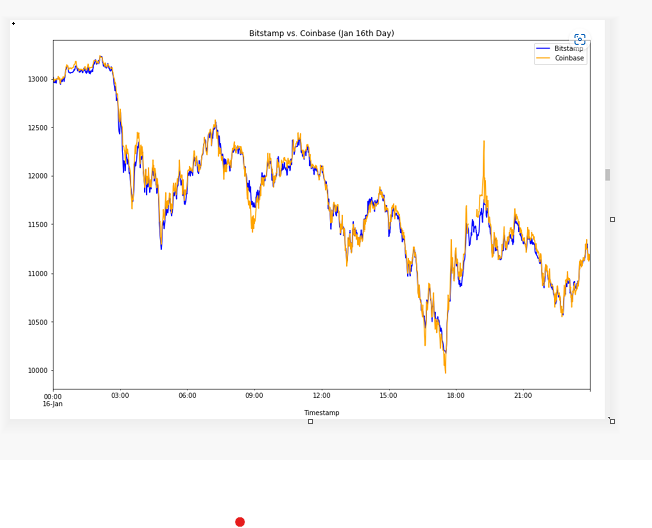
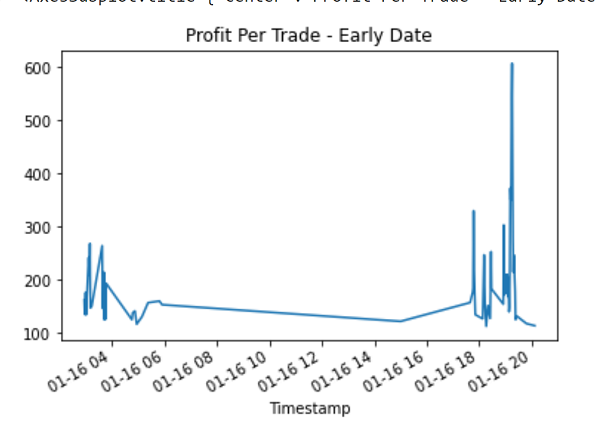
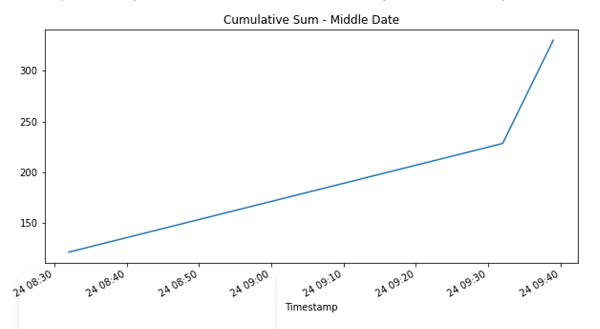

# Bitcoin_Arbitrage_Analysis

The purpose of this application is to find arbitrage opportunites in Bitcoin trading across two exchanges i.e. Bitstamp and Coinbase. For this application, historical trade data for Bitcoin on two exchanges: Bitstamp and Coinbase has been used. This application applies  three phases of financial analysis that is to collect, prepare and analyze data to determine if any arbitrage opportunities exist for Bitcoin.

## Technologies

This project leverages python 3.9 with the following packages:
*[Jupyter notebook file]
*[pandas]
*[matplotlib]

## Installation Guide

Before running the application first install the following dependencies.

```python
pip install Jupyter lab
pip install pandas
pip install matplotlib
```

## Usage

To report on arbitrage profit opportunities ananlysis of Bitcoin accross Bitstamp and coinbase. 
Following steps in the analysis:

## Data Collection

Dataframes bitstamp and coinbase is created using the Pandas read_csv function and the Path module by importing the data from bitstamp.csv file and coinbase.csv file. The Timestamp column is set as index column

## Data Preparation

1 Collected data is then prepared and cleaned for analysis by following the steps below for both bitstamp and coinbase dataframes:

2 Replaced all NaN, or missing, values in the DataFrame with mean of that column.

3 Using the str.replace function to remove the dollar signs $ from the values in the Close column.
Convert the data type of the Close column to a float.

4 Review the data for duplicated values, and dropping them.

## Data Analysis

### Selecting the data to be analyze

By Using loc function to select the following columns of data for both the bitstamp and coinbase DataFrames:

Timestamp (index)

Close

### Summary Statistics and Plot the Data

```python
count    129067.000000
mean      10459.842453
std        2315.976088
min        5944.000000
25%        8613.370000
50%       10145.950000
75%       11444.810000
max       17234.980000
Name: Close, dtype: float64

count    129322.000000
mean      10449.140958
std        2317.197419
min        5882.310000
25%        8609.230000
50%       10137.440000
75%       11397.237500
max       17177.990000
Name: Close, dtype: float64
```


### Initial findings
The degree of change reduces with time but it is not obvious of where to buy from and sell into for the arbitrage profit. To evaluate further, data from both exhanges need to be analyzed for specific days to determine arbitrage opportunities


### Focusing on specific days

Assuming that we buy from bitstamp and sell in coinbase marketplace.

- Choosing one date that’s early in the dataset(January 16, 2018).
- One from the middle of the dataset(February 24, 2018).
- One from the later part of the time period(March 28, 2018).

### Summary statistics for early, middle and late

```Python
count    1419.000000
mean       23.212135
std        67.789186
min      -275.920000
25%        -8.330000
50%        22.280000
75%        52.355000
max       606.800000
Name: Close, dtype: float64

count    1437.000000
mean        3.396131
std        22.969472
min       -50.180000
25%       -10.590000
50%        -0.010000
75%        12.120000
max       121.320000
Name: Close, dtype: float64

count    1432.000000
mean       -0.722193
std         8.523060
min       -32.040000
25%        -6.812500
50%        -0.730000
75%         4.965000
max        35.070000
Name: Close, dtype: float64
```

**Early**
1419 data points exist, an average difference between the two prices is 23.21, maximum difference between two prices is 606.80 and minimum value is -275.92, tells us that a time existed when Coinbase had a higher price than Bitstamp.

**Middle**
4137 data points exist, an average difference between the two prices is 3.39, maximum difference between two prices is 121.32 and minimum value is -50.18, still tells us that a time existed when Coinbase had a higher price than Bitstamp but at very diminishing rate.

**Late**
1432 data points exist, an average difference between the two prices is -0.72, maximum difference between two prices is 35 and minimum value is -32.04, tells us both exchanges are almost moving together.




### Calculating the arbitrage profits

#### Subtracting arbitrage spread difference for all three dates than considering only positive data for summary statistics

```python

arbitrage_spread_early = coinbase_sliced.loc['2018-01-16'] - bitstamp_sliced.loc['2018-01-16']
# For the date middle in the dataset, measure the arbitrage spread between the two exchanges
arbitrage_spread_middle = coinbase_sliced.loc['2018-02-24'] - bitstamp_sliced.loc['2018-02-24']
# For the date late in the dataset, measure the arbitrage spread between the two exchanges
arbitrage_spread_late = coinbase_sliced.loc['2018-03-26'] - bitstamp_sliced.loc['2018-03-26']

count    960.000000
mean      53.405344
std       53.910409
min        0.010000
25%       21.602500
50%       39.885000
75%       68.547500
max      606.800000
Name: Close, dtype: float64

count    713.000000
mean      19.880351
std       20.699851
min        0.010000
25%        5.040000
50%       12.330000
75%       27.250000
max      121.320000
Name: Close, dtype: float64

count    651.000000
mean       6.689247
std        5.240159
min        0.010000
25%        2.835000
50%        5.230000
75%        9.195000
max       35.070000
Name: Close, dtype: float64
```

### Converting arbitrage spread to percentage return for all three dates

```python
# For the date early in the dataset, calculate the spread returns by dividing the instances when the arbitrage spread is positive (> 0) 
# by the price of Bitcoin from the exchange you are buying on (the lower-priced exchange).
spread_return_early= arbitrage_spread_early[arbitrage_spread_early> 0] / bitstamp_sliced.loc['2018-01-16']

# For the date middle in the dataset, calculate the spread returns by dividing the instances when the arbitrage spread is positive (> 0) 
spread_return_middle=arbitrage_spread_middle[arbitrage_spread_middle> 0] / bitstamp_sliced.loc['2018-02-24']

# For the late in the dataset, calculate the spread returns by dividing the instances when the arbitrage spread is positive (> 0) 
spread_return_late=arbitrage_spread_late[arbitrage_spread_late> 0] / bitstamp_sliced.loc['2018-03-26']
```

### Generating summary statistics for data which is more than 1% of profit(i.e. considering 1% as cost of conducting trade)

```python
# For the date early in the dataset, determine the number of times your trades with positive returns 
# exceed the 1% minimum threshold (.01) that you need to cover your costs
profitable_trades_early = spread_return_early[spread_return_early> .01]

# For the date middle in the dataset, determine the number of times your trades with positive returns 
profitable_trades_middle = spread_return_middle[spread_return_middle> .01]

# For the date late in the dataset, determine the number of times your trades with positive returns 
profitable_trades_late = spread_return_late[spread_return_late> .01]
```

### Summary Statistics for profitable trades

```python
count    73.000000
mean      0.016720
std       0.007628
min       0.010109
25%       0.012061
50%       0.014794
75%       0.018124
max       0.051633
Name: Close, dtype: float64

count    3.000000
mean     0.011377
std      0.001199
min      0.010431
25%      0.010703
50%      0.010974
75%      0.011850
max      0.012726
Name: Close, dtype: float64

count    0.0
mean     NaN
std      NaN
min      NaN
25%      NaN
50%      NaN
75%      NaN
max      NaN
Name: Close, dtype: float64
```

### Calculating profit by multiplying profitabe trade and close columns for all three dates

```python
# For the date early in the dataset, calculate the potential profit per trade in dollars 
# Multiply the profitable trades by the cost of the Bitcoin that was purchased
profit_early = profitable_trades_early * bitstamp_sliced.loc['2018-01-16']

# For the date middle in the dataset, calculate the potential profit per trade in dollars 
profit_middle = profitable_trades_middle * bitstamp_sliced.loc['2018-02-24']

# For the date late in the dataset, calculate the potential profit per trade in dollars
profit_late = profitable_trades_late * bitstamp_sliced.loc['2018-03-26']

# Drop any missing values from the profit DataFrame
profit_per_trade_early = profit_early.dropna()
profit_per_trade_middle = profit_middle.dropna()
profit_per_trade_late = profit_late.dropna()
```

### Summary statistics  plots for profit per trade 




### sum total per trade and cumulative profit 

```python
# Calculate the sum of the potential profits for the early profit per trade DataFrame
display(profit_per_trade_early.sum())
print()
# Calculate the sum of the potential profits for the middle profit per trade DataFrame
display(profit_per_trade_middle.sum())
print()
# Calculate the sum of the potential profits for the late profit per trade DataFrame
display(profit_per_trade_late.sum())

# Use the cumsum function to calculate the cumulative profits over time for the early profit per trade DataFrame
cumulative_profit_early =  profit_per_trade_early.cumsum()

# Use the cumsum function to calculate the cumulative profits over time for the middle profit per trade DataFrame
cumulative_profit_middle =  profit_per_trade_middle.cumsum()

# Use the cumsum function to calculate the cumulative profits over time for the late profit per trade DataFrame
cumulative_profit_late =  profit_per_trade_late.cumsum()
```
### cum sum total per trade 





## Conclusion

The arbitrage profit opportunities for Early period(January 16, 2018) is more compared to the remaning periods.
The arbitrage sum total profit for early period is $14147.169

The arbitrage profit of $330.07 that occured during middle period (February 24, 2018) Concludes that there is very less opportunity than the early period.

There are no profitable arbitrage trades in the late period(March 28,2018).Thus the prices for both the Exchanges remain almost same.
